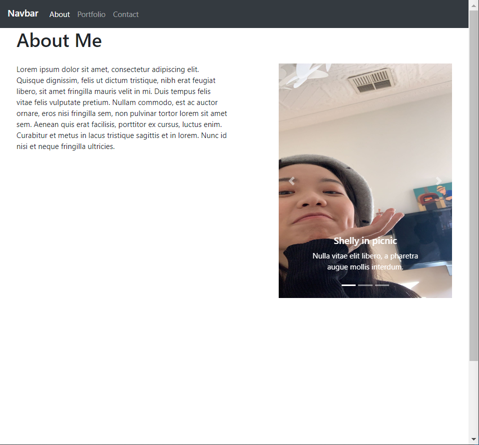

## Portfolio
This page has imply the .card-img-top which source by the booststrap.  

## Table of Content
* [Project Links](#Project-Links)
* [Screenshots-Demo](#Screenshots)
* [Project Objective ](#Project-Objective)
* [Installation](#Installation)
* [Technologies](#Technologies)
* [Contact](#Contact)
* [License](#License)
## Project Links
* [Github Repo](https://github.com/zoeshelly-tan/portfolio)
* [Github link](https://zoeshelly-tan.github.io/portfolio/)

## Project Objective

Responsive portfolio design contain 4 page, which are the "contact", "index","portfolio", "submit". Most of the design has imply booststrap. All the page is responsive with the windows of image. 
### Contact:
This page has contain navbar, container with form-group to input "email, name, message", also contain a footer that indicate create by shelly in 2020. Then the submit button will lead to a page of "submit".

### Index
This page has contain a image slide and text. There is a pink border-color to high light the text. 

## Installation
- Node.js 
- npm install
- react

## Technologies
-      Node.js
-      Javascript
-      Heroku
-      react
-      Json
-      API
## Display 

## Author Contact
Contact the author with any questions! 
Github link: [Shelly](https://github.com/zoeshelly-tan)
## License
This project is [MIT](https://choosealicense.com/licenses/MIT/) licensed.

